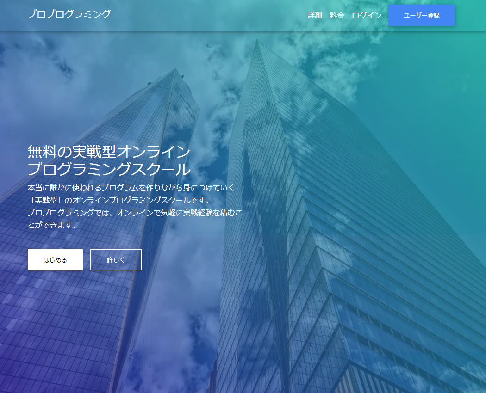

# README

Alder is one of my tries; create a good product to make impacts on this world.

the concept is:

- this is for people who want to be a software developer
- they can find "actual" problems on this web site
- they need to solve the problems with experienced programmer so that they can learn "Actual level" of programming

top page screen shot:

I released this web app, but I found this web app would not be a hit for multiple reasons(ask me in person if you are interested). I need to try next idea and no time to keep developping this anymore.

I used:

- Ruby on Rails
- React/Redux
- Material-ui
- MySQL
